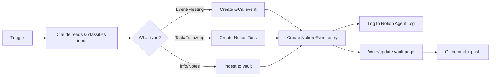

# Autonomous Agent — Pipeline Spec

> The operating rules for the autonomous Claude agent. Every session that runs this pipeline should read this first.

---

## The Full Pipeline



---

## Input Channels

| Channel | How Claude receives it | Status |
|---------|----------------------|--------|
| **Slack** | `slack_read_channel` / `slack_search_public_and_private` | ✅ Live |
| **Gmail** | `search_threads` | ✅ Live |
| **Microsoft / UVA Outlook** | `outlook_email_search` / `outlook_calendar_search` | ✅ Live |
| **Manual (Cowork)** | Direct message to Claude in Cowork | ✅ Always |
| **Telegram** | ❌ No connector — Python bot needed | 🔲 Future |
| **Scheduled** | Cowork cron trigger fires session | ✅ Live |

---

## Input Classification Rules

When Claude receives an input, classify it immediately:

| Input contains... | Action |
|-------------------|--------|
| Date + time + person | → **Event** (GCal + Notion Events) |
| "remind me", "follow up", "don't forget" | → **Task** (Notion Tasks) |
| Article, notes, file, long text | → **Ingest** (vault source page) |
| Course, assignment, exam, grade | → **Academic** (Notion Academic Planner) |
| Project update | → **Project** (Notion Projects + vault) |
| Ambiguous | → Create Task with `Status: Inbox`, flag for review |

---

## Output Map: Trigger → Where It Goes

### Event (meeting, call, deadline)
1. Extract: title, date/time, attendees, context
2. `create_event` → Google Calendar
3. Notion Events DB → new entry (`GCal Synced: ✅`)
4. Append to `wiki/log.md`
5. Git commit

### Task (to-do, follow-up, reminder)
1. Extract: task description, due date if present, project context
2. Notion Tasks DB → new entry
3. Append to `wiki/log.md`
4. Git commit (only if substantive — skip for minor tasks)

### Ingest (article, notes, file)
1. Read/summarize the source fully
2. Write `wiki/sources/<Title>.md`
3. Propagate to relevant `wiki/entities/` and `wiki/concepts/` pages
4. Update `wiki/index.md`
5. Append to `wiki/log.md`
6. Git commit + push

### Academic (course, assignment, exam)
1. Notion Academic Planner → Courses / Assignments / Exams & Deadlines DB
2. GCal event if it has a date
3. Append to `wiki/log.md`

---

## Vault ↔ Notion Mapping

| Vault | Notion |
|-------|--------|
| `wiki/log.md` | Agent Log DB |
| `wiki/sources/<X>.md` | (no direct mirror — vault owns sources) |
| `wiki/entities/<Person>.md` | Contacts DB |
| `wiki/analyses/<Project>.md` | Projects DB |
| Events / meetings (in log) | Events DB |
| Tasks (in log) | Tasks DB |
| Courses / study goals | Academic Planner → Courses + Study Goals |

**Rule:** Notion is the **operational layer** (quick lookup, scheduling, task management). The vault is the **knowledge layer** (synthesis, analysis, long-form). They don't duplicate — they complement.

---

## Git Sync

### Short-term (manual)
- User installs **Obsidian Git** (Community Plugin) — Settings → Community Plugins → search "Obsidian Git"
- Configure: auto-commit every 30 min, auto-push on commit
- Repo: `https://github.com/Tstansberry81/vault`

### Long-term (automated)
- Agent triggers a `git add -A && git commit && git push` after every significant write
- Requires Obsidian to be closed OR the lock to be clear (Obsidian Git handles this natively)

---

## Autonomy Rules (CLAUDE.md Addendum)

### Fully autonomous (no confirmation needed)
- Creating GCal events from clear date/time inputs
- Creating Notion tasks and events
- Appending to `wiki/log.md`
- Logging to Notion Agent Log
- Replying to confirm action was taken (in Slack or Cowork)

### Ask before doing
- Writing a new vault **source page** (ingest) — briefly summarize and confirm
- Creating or modifying a vault **entity page** — confirm if adding new personal info
- Deleting anything
- Sending any email or Slack message on Trav's behalf
- Making financial transactions of any kind

### Never do autonomously
- Send emails
- Move money
- Delete calendar events
- Modify `CLAUDE.md` or this pipeline spec without explicit instruction

---

## Telegram (Future — Python Phase)

Telegram requires a Python bot webhook. This is planned for Summer 2026 (Python learning goal). Architecture:

```
Telegram message → Telegram Bot API (Python) → webhook → POST to Cowork trigger → Claude runs pipeline
```

Until then: **use Slack `#agent` channel as the universal input interface.**

---

## Scheduled Pipeline (Daily Briefing — Planned)

Future daily trigger at 8am:
1. Pull GCal events for the day
2. Pull Notion Tasks due today / overdue
3. Pull unread Slack messages since last check
4. Synthesize a morning briefing
5. Send to Slack `#briefings` channel (or Telegram when live)

---

## Related Pages

- [[Autonomous Agent — Project Infrastructure]]
- [[log]]
- [[overview]]
