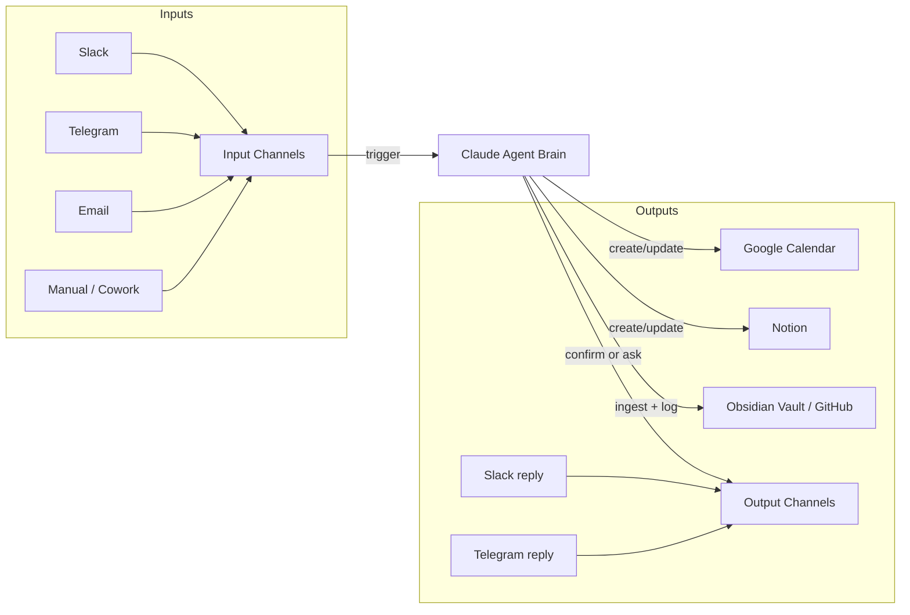

# Autonomous Agent — Project Infrastructure

> **Goal:** A fully autonomous AI agent that acts as a personal scheduler and assistant — ingesting inputs from multiple channels, reasoning about them, and writing outputs to Notion, Google Calendar, and this Obsidian vault. Zero-code to start; Python layer added incrementally.

---

## Vision

An always-on Claude-powered agent that:
- **Listens** on multiple input channels (Slack, Telegram, email, manual)
- **Reasons** about what each input means and what action to take
- **Acts** by writing to Notion, Google Calendar, and the vault — without being asked twice
- **Logs everything** back into the wiki so the knowledge base compounds

The human's job: send messages and curate high-level goals. Claude's job: everything else.

---

## Architecture Overview



---

## Connectors to Implement (Priority Order)

| Connector | Purpose | Status |
|-----------|---------|--------|
| **Slack** | Primary input + output channel | 🔲 To connect |
| **Google Calendar** | Event creation, scheduling | 🔲 To connect |
| **Notion** | Structured database (tasks, contacts, events) | 🔲 To connect (workspace TBD) |
| **Telegram** | Secondary input channel, mobile-friendly | 🔲 To connect |
| **GitHub** | Vault backup + version history | ✅ Remote set (`Tstansberry81/vault`) |
| **Gmail** | Email as trigger input | 🔲 Future |

---

## Trigger Types (Planned)

| Trigger | Example Input | Agent Action |
|---------|--------------|--------------|
| Business call mention | "call with X at 3pm Thursday" | Add to GCal + Notion + vault log |
| Task assignment | "remind me to follow up with Y" | Create Notion task + GCal reminder |
| Meeting notes drop | Paste raw notes into Slack | Summarize + ingest to vault |
| Daily briefing | Scheduled (e.g., 8am) | Pull GCal + Notion + vault → summary in Slack/Telegram |
| Manual ingest | Drop file/article | Process per vault ingest protocol |
| Remote control | Telegram message → Cowork action | Trigger vault reads, writes, lookups |

---

## CLAUDE.md Additions (Planned)

A second CLAUDE.md (or a new section in this one) will govern autonomous agent behavior:

- **Trust levels:** which inputs are fully autonomous vs. require confirmation
- **Output rules:** what gets logged to vault vs. only written to Notion/GCal
- **Tone + format for replies:** how the agent responds back in Slack/Telegram
- **Scope limits:** what the agent explicitly will NOT do autonomously (e.g., send emails, delete events)
- **Escalation protocol:** when Claude isn't confident, it asks rather than guesses

> **This is the highest-priority doc to write before autonomous mode goes live.**

---

## Notion Workspace Structure (To Build)

Once the Notion connector is live, Claude will scaffold:

- **Events DB** — business calls, meetings, appointments (linked to GCal)
- **Tasks DB** — follow-ups, to-dos, reminders
- **Contacts DB** — people mentioned in inputs, linked to events/tasks
- **Log** — mirror of vault `log.md` for non-Obsidian access

---

## GitHub Vault Sync

- Repo: `https://github.com/Tstansberry81/vault`
- Remote is set. To push: open Terminal, `cd` to vault folder, run:
  ```bash
  git push -u origin main
  ```
- Long-term: automate via a daily scheduled git commit + push (Python script or GitHub Action)

---

## Phased Roadmap

### Phase 0 — Infrastructure (NOW)
- [x] GitHub remote set for vault
- [ ] Create Desktop `Autonomous Agent/` folder
- [ ] Connect Slack, GCal, Notion, Telegram in Cowork
- [ ] Draft autonomous CLAUDE.md behavior rules

### Phase 1 — First Automation
- [ ] Slack message → Claude extracts event details → GCal event created
- [ ] GCal event → Notion entry created
- [ ] Both logged to vault

### Phase 2 — Daily Briefing
- [ ] Scheduled 8am Claude run: pulls GCal + Notion → sends digest to Slack or Telegram

### Phase 3 — Full Remote Control
- [ ] Telegram as command interface: "what's on my calendar this week?" → Claude replies
- [ ] "Add a task: follow up with John" → Notion + GCal updated

### Phase 4 — Python Layer
- [ ] Lightweight Python wrapper for custom logic
- [ ] Webhook listener for real-time Slack/Telegram triggers
- [ ] Scheduled GitHub push

---

## Open Questions

- What cadence for the daily briefing? Morning only, or morning + evening?
- Should Notion be the primary "truth" for tasks, or the vault?
- For Telegram: bot-based (you message a bot) or group-based?
- Escalation: when agent is unsure, does it ask in Slack, Telegram, or both?

---

## Related Pages

- [[overview]]
- [[log]]
