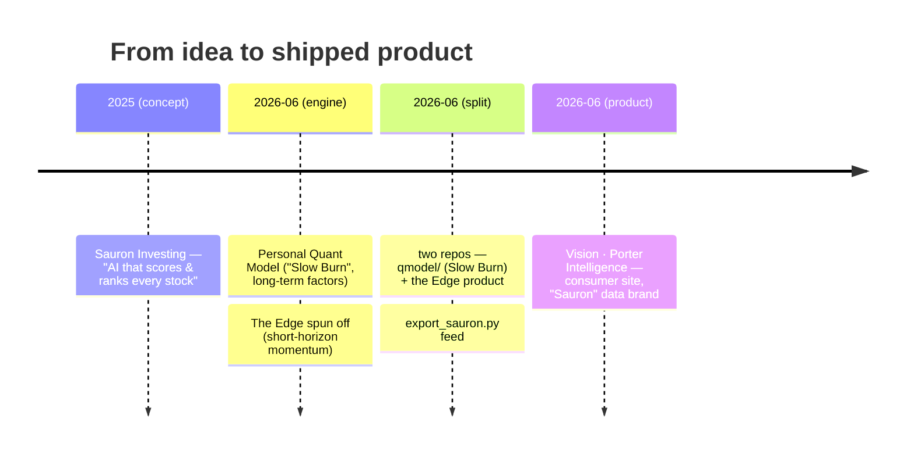

# Sauron Investing

[[Traveler Stansberry]]'s personal **stock-analysis web app** — a side project distinct from [[Homework Hatch (startup)]], aimed at his own [[Investment Club|investing]] practice. The name evokes an all-seeing market eye.

## The idea
An AI system that ingests market data, scores every stock, and writes ranked investment reports. The chats show him shopping for a **financial-data provider** (e.g. Fiscal.ai) to power it and pressure-testing where the data would come from ([[Fiscal.ai API Access and the Sauron Investing App (chat)]], [[Building a Custom AI Stock-Ranking Model (chat)]]). It's the applied, code-it-yourself bridge between his fundamental investing and his [[Quantitative Finance|quant]] turn.

> [!note] Likely evolved into the [[Personal Quant Model]]
> The July 2025 "AI that scores every stock and ranks the best picks" concept here closely matches the **[[Personal Quant Model]]** he had produced (his design, AI-coded) by June 2026 (multi-factor scoring + ranking, web app, data-provider integration). Sauron Investing reads as the early scoped version; the Personal Quant Model is the realized, far more rigorous one.

> [!update] "Sauron" is now the live product name (2026-06-18)
> The June 2026 code ingest closes the loop: **Sauron survived as the internal product brand.** The [[The Edge (trading model)|Edge]] repo's export pipeline (`export_sauron.py`) emits `window.VISION_DATA`/`SAURON_DATA`, and the consumer site that renders it ships publicly as **[[Vision (Porter Intelligence)]]** — styled for his father's [[Porter Stansberry (father)|Porter & Co.]] house. So the arc is: *Sauron Investing (2025 concept) → [[Personal Quant Model]] / [[The Edge (trading model)]] (the engines) → Vision / Sauron (the shipped product).*

## The lineage

## See also
[[Personal Quant Model]] · [[The Edge (trading model)]] · [[Vision (Porter Intelligence)]] · [[Porter Stansberry (father)]] · [[Investment Club]] · [[Quantitative Finance]] · [[Honeycomb Portfolio]] · [[Homework Hatch (startup)]]
