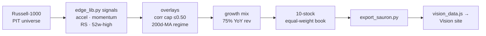

# The Edge (trading model)

The **short-term trading sibling** of [[Traveler Stansberry]]'s [[Personal Quant Model]], now **split into its own codebase** (`raw/quant model.zip`, June 2026). Where the original model bundled a long-term fundamental engine ("Slow Burn") and this short-term trader together, the git history records the divorce — *"Split into two codebases: this repo is now the Edge product only."* This repo is the **in-house model + viewer**; its public face is the [[Vision (Porter Intelligence)]] product, fed by the **[[Sauron Investing|Sauron]]** export.

> [!important] Authorship (same caveat as the [[Personal Quant Model]])
> Per Traveler's standing note on these projects, **the strategy and methodology are his; the code is AI-generated** (his [[Cursor (AI code editor)|vibe-coding]] workflow). Read it as evidence of quant *judgment*, not hand-coding — see [[UVA and the Quant Question]] and tension #8 in [[Tensions and Open Questions]].

## What it is — and how it differs from Slow Burn
The Edge ranks on **market data only — no fundamentals**: short-horizon momentum, relative strength, and **momentum acceleration** ("BIC on a short clock"), holding ~30–60 days on a **1-month (21-trading-day) rebalance clock**. Its code docstring brands it for **"Porter & Co"** — his father's firm (see [[Porter Stansberry (father)]]). Contrast with the [[Personal Quant Model|Slow Burn]] engine (fundamentals + HMM regime + gold sleeve, long-horizon), which is preserved untouched in the repo's `qmodel/` package and reused only for its cached data loaders.

## The model
1. **Universe** — a **Russell-1000 proxy**, top names by **point-in-time market cap** (pluggable real PIT layer via Norgate/CSV when present; falls back to the survivorship-biased top-1000-by-mcap proxy otherwise — flagged in code).
2. **Signals** (`edge_lib.py`) — `ret_21 / ret_63 / ret_126` (trailing returns), **`accel`** (momentum acceleration, the headline signal), `hi_252` (52-week-high proximity), `rs_63` (relative strength). All hand-rolled in numpy (no statsmodels in the venv).
3. **Growth mix** — an optional blend of **YoY revenue growth** into the rank, exposed as a selector (Off / 25 / 50 / 75 / 100%); the product ships at **75%**.
4. **Two proprietary overlays** — a **correlation cap (≤0.50)** so the 10-name basket isn't eight versions of one bet, and a **200-day-MA regime switch** that raises cash when the market is below its 200-day line.
5. **Book** — **10-stock equal-weight** (`N = 10`), net of **~10 bps** turnover cost.

## The app
A Flask site (`app.py`) with: a **Model page** giving the full equation spec in **KaTeX**; an **Edge Tracker** (current book + portfolio dropdown); basket-size / window / rebalance-clock / growth-mix controls synced across pages; a backtester reporting **CAGR, Sharpe, Sortino, max drawdown, best/worst-period and pre-tax stats, and an "amount-invested" view** over **1Y / 2Y / 5Y / 10Y / 20Y / MAX** windows; and an in-app, **rate-limited, grounded chat assistant** ("explain the numbers") on the **Claude / Anthropic API**. Stack: pandas, numpy, scipy, scikit-learn, hmmlearn, yfinance, Flask, anthropic, gunicorn; deploy via Render (`render.yaml`, standard 2 GB plan — the backtest panel peaks ~0.8–1.2 GB).

## How it ships (data flow)

## The honest read on performance
The launch export (`as_of` 2026-04-17, 1M / 75% mix) shows a **flattering short window and a sober long one** — the kind of gap the repo's own `DEPLOY.md` warns not to quote away:

| Window | CAGR | Sharpe | vs S&P (excess CAGR) |
|---|---|---|---|
| **2Y** (headline) | **~49.8%** | **1.65** | **+29.1%/yr** |
| 5Y | 18.1% | 0.73 | +4.2%/yr |
| 10Y | 15.2% | 0.71 | **−0.4%/yr** |
| 20Y | 14.5% | 0.71 | +3.4%/yr |

![[edge-cagr-vs-sp500.png]]
*The Edge vs S&P 500 (TR), annualized return by backtest window — launch export 2026-04-17, net of ~10 bps. The 2Y bar dwarfs the market; by 10Y the gap is gone.*

So the eye-popping 2Y number rides a recent momentum regime; across 10–20 years the Edge roughly **matches the S&P on a risk-adjusted basis** (Sharpe ~0.71, near-zero 10Y excess). That this is visible at all — and explicitly caveated in `DEPLOY.md` ("don't quote short-window returns as expected performance") — is consistent with the intellectual honesty already noted on the [[Personal Quant Model]] and [[Physics IA]]. The launch book skews toward high-beta momentum names (AAOI, CAR, VRT, NIO, MARA, CRWV…), which is exactly what a short-horizon acceleration signal would surface late in a momentum run.

## Why it matters
It is the **product-ization** of the quant work: the Slow Burn research engine spun off a tradeable short-horizon strategy, wrapped in a viewer, and pointed at a consumer site under his father's brand. For the [[UVA and the Quant Question|quant question]] it adds **breadth** (he now reasons fluently about short-horizon factor trading, regime overlays, and correlation caps — not just long-only factor scoring) but **no new evidence on hands-on rigor**, since the code remains AI-generated.

> [!warning] Security
> Same as the sibling repo: the archive carries a `.env` and git history that **previously hard-coded the Fiscal.ai API key** (`config.py` comment says to rotate it). Treat the zip's `.env` / history as sensitive; rotate the Fiscal.ai key and any Anthropic key if still live.

## See also
[[Personal Quant Model]] · [[Vision (Porter Intelligence)]] · [[Sauron Investing]] · [[Quantitative Finance]] · [[Porter Stansberry (father)]] · [[Honeycomb Portfolio]] · [[UVA and the Quant Question]] · [[Traveler Stansberry]]
